Introduction
============

One week-end I decided to see if it was possible to salvage parts from
broken LED lights for use in other projects.  Since these lights are
composed of numerous small LEDs, I wondered if they could be used in
lower-voltage projects.

E14 E27 3528 Bulb
=================

This bulb was obtained cheaply off Ebay but it didn't last long.  It seems to
be this single LED that failed open-circuit thereby taking the whole thing out.

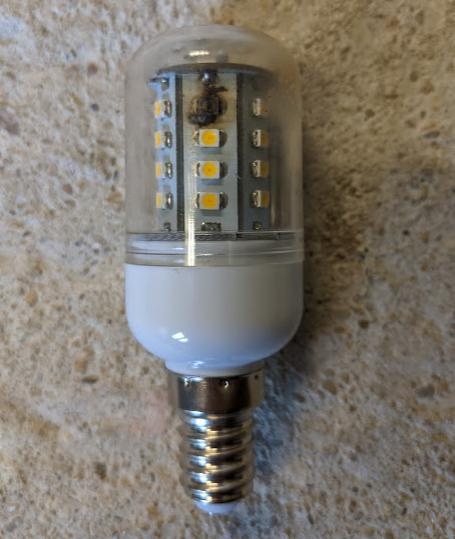

It was easy to separate the two parts and get the LED section out, just pulling
with moderate pressure did the trick.  It was joined to the electronics with two 
wires which I cut.  A simple bridge rectifier and smoothing capacitor,
no constant-current generator that I could make out.

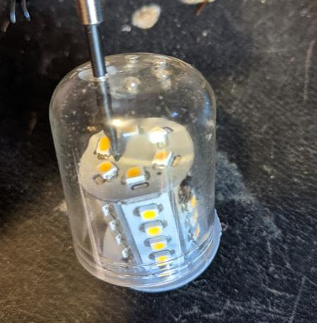

I used my wire-strippers as a clamp (I really 
shouldn't, but they're always to hand)

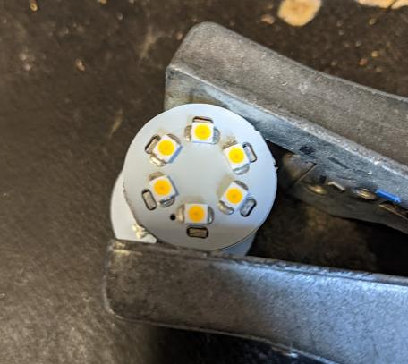

The LED section consists of 6 PCBs joined in a cylinder and connected to two 
circular PCBs at each end.  The upper PCB sports 6 more LEDs, the lower one 
has the electronics

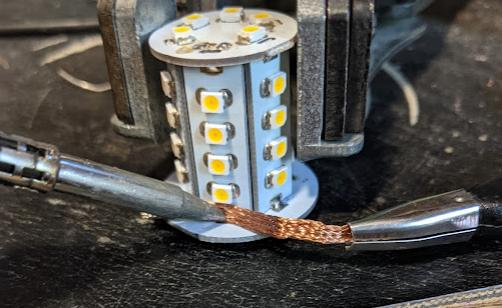

I really liked that I didn't need to resort to hot air and yanking to 
de-solder these PCBs they came apart cleanly with nothing more than braid

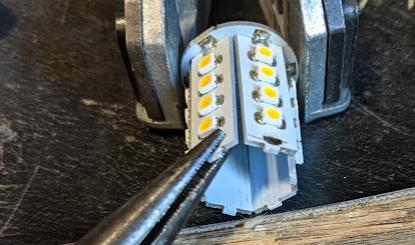

And each section could be used independently as 4-LED array, just perfect
for low voltage projects.

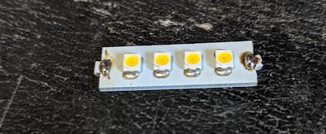

Connected up these gave good brightness at around 10v across the four.  Each 
side-PCB is 4 LEDs series-connected.  The pads at each end were easy to connect
solid-core wire to.  It was clear the LEDs contained their own series resistors.
I think they must have done it this way so they don't need any complex current 
generator circuits and they can spread the power dissipation across all the LEDs
instead of having some meaty resistors inside the unit which would heat up.

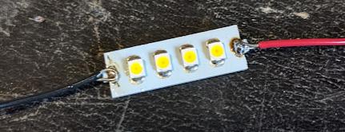

So that's my haul for the parts bin.  But since I wasn't sure if I wanted to use 
10v for my project (I'd need two PSU voltages, 5v for any MCU and 10V for the lamps)
I checked to see if I could desolder LEDs and use them individually at lower 
voltages.

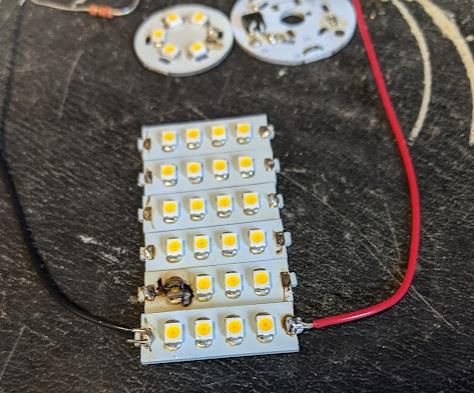

Getting an LED off was easy with two soldering irons, I just used them as hot
tweezers, although I melted the plastic sides of the LED a little in doing
so.  These are clearly not meant to be soldered with an iron because it's
hard to get the iron on the contacts without touching the plastic.  I have a hot 
air rework station, but it's not very good with temperature regulation and has a 
habit of destroying components (at least when I'm using it) so I didn't use it here.

In any case, once the SMD LED was off, I prepared some stripboard, to connect it.
A couple of blobs of solder were going to be my 'paste' I decided to try to melt
the solder from the side with the LED on top and hope it settled in the right place.

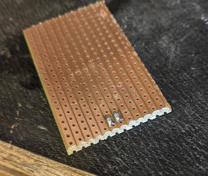

I thought a flux pen would be desirable for this, so I put some on top of the two
blobs of solder on the board.

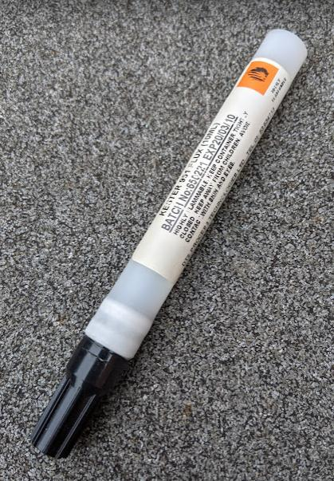

At this point, bearing in mind the LED casing was plastic and seemingly very easy
to melt with my iron, my plan was to rest the LED at an angle, and then melt the 
solder from underneath it.  Hopefully I'd melt both blobs in quick succession so 
it settled into a sensible position.

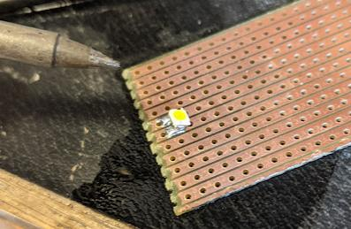

And it turned out that it did, indeed settle, and the operation went a lot better 
than I expected.  Some would have purchased solder paste, and/or adapter boards, 
but I always found that stuff expensive, so I've tried to manage without.

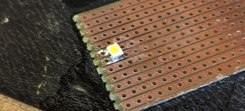

So with the board cut smaller and some headers attached I could now bread-board 
the LED

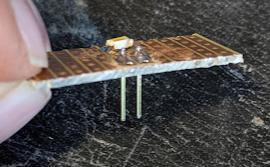

It even switched on when I ran my continuity tester across it.

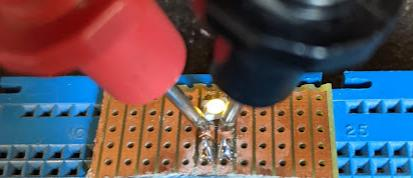

And it gave reasonable brightness with the expected voltage.

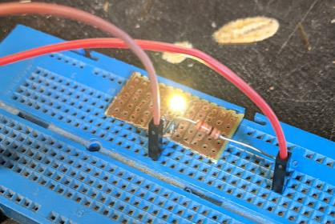

Philips 11w Bayonet
===================

A lot more posh, more powerful and expensive, the Philips bulbs in my home have
tended to last a lot longer than any of the cheap stuff, but this unit failed somewhat
earlier than the stated life would have suggested all the same.

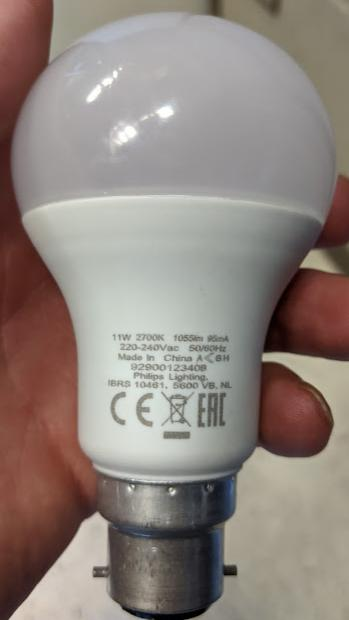

But re-using any of this tech is a lot more of a challenge than it was for
the cheap bulb above.  The first problem was how to get into it.  The diffuser didn't
unscrew despite my best efforts.  I started hack-sawing off the bayonet.  That didn't
help in the slightest.  So when I had almost given up I had a hunch.  I got out a brick
bolster (that's used for cutting bricks in half), and a lump hammer.  I gave one
sharp blow and the thing came apart.  In fact, it came apart so cleanly and with so
little damage I honestly don't think there's a better way than this.

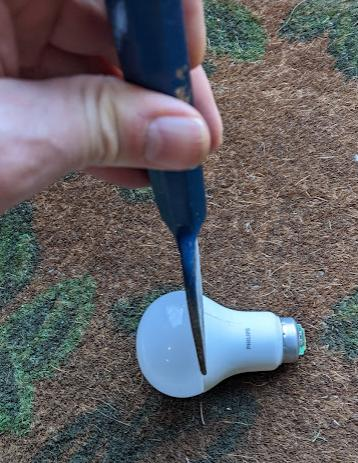

You can see inside the rubber gunk that was presumably holding that plastic diffuser
so firmly in position.  I was immediately a bit disappointed because I could see that
there were only 11 LEDs and the voltage drop across each was going to be fairly high
so not of much use for my project.  Since I'd gone this far I decided to still try to
see if I could open the thing further out of curiosity.   Next step was to try to 
open the lower part.

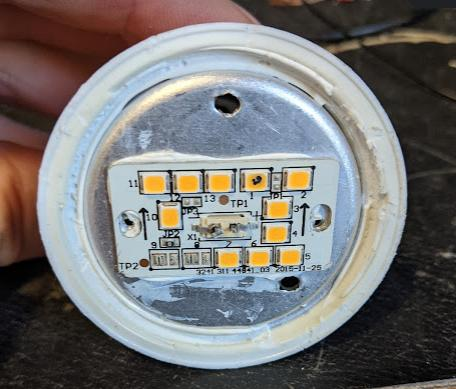

Again, this was really difficult.  I could see that I might be able to pull out the 
metal heatsink below the LED PCB but it wouldn't budge.  I widened one of the holes
to get some flat bladed tools through to try to rotate it but it wasn't moving
So I decided to just forget about the electronics inside and get the LEDs.

Removing the 'PCB' was fairly easy.  There was some sticky, presumably heat-conductive
gunk and cutting through that it slowly lifted off.

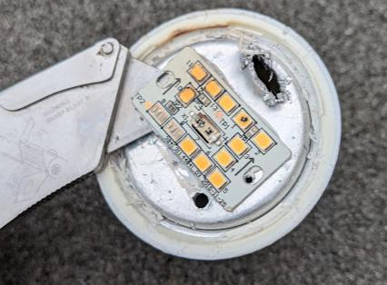

The 'PCB' wasn't actually a PCB at all in the conventional sense.  It seemed to be a
very thin-film PCB element, laid atop a steel plate.  My attempts to de-solder the LEDs
from the PCB went nowhere, but it wasn't surprising because the heat was 
probably conducted away by the steel backing plate.  

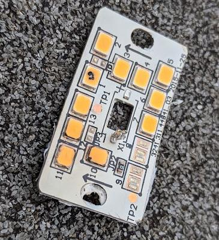

Just while I'm here, I sawed open the rest of the bulb to pull out the electronics
(it was the only way) and discovered what looked to be a 'proper' constant current
generator circuit

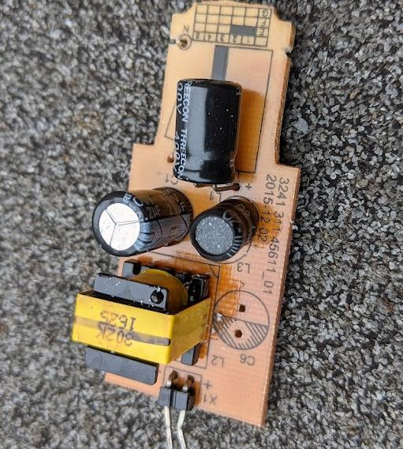

...with some kind of supervisor chip along with the bridge.  I may look into how this 
works later.

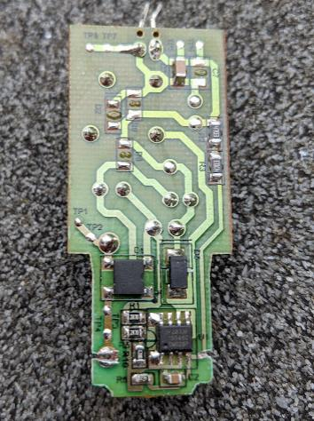

But next off I removed all the gunk from the LED board, in preparation for using hot
air.

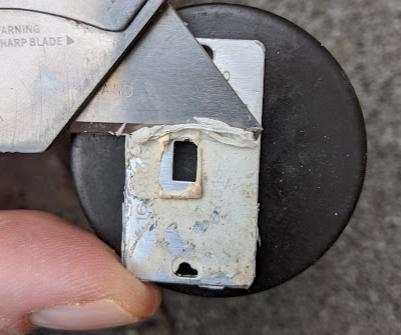

At first I tried just heating the board from the back, and lifting components off.
This wasn't very satisfactory, and I damaged some LEDs like this.

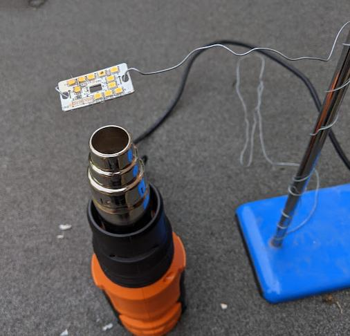

Then I had another idea.  Since I had a powerful heat gun I'd use it to literally 
blow the components off the board, that way they wouldn't hang around any longer than
they needed to, as soon as the solder was melted they'd be blown out of the heat path.

I cleared a wide area of space, so I could spot the components later, blasted the heat
at the board, and didn't worry too much about where they were going.

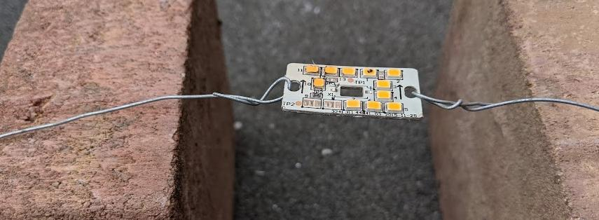

I collected them all up.  The melted ones were damaged in the earlier attempt. 
My approach with blasting them off the board was highly effective and
resulted in minimal damage.  You just need a decent space to work in.

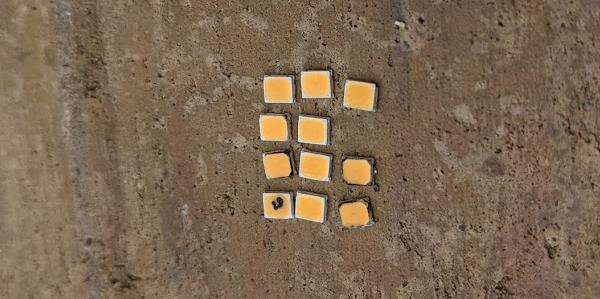

Next I did the same as I'd done for the E14 lamp LEDs.  Flux pen, a couple of solder 
blobs, 

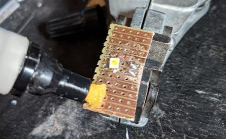

I think I tried to solder this more from the sides because it was a different shape
and slightly larger.  It wasn't quite so easy and the pads weren't even sizes, one
was about double the size of the other.

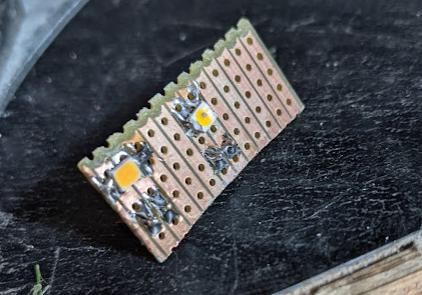

And it also worked!

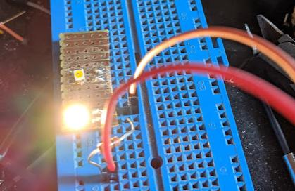

